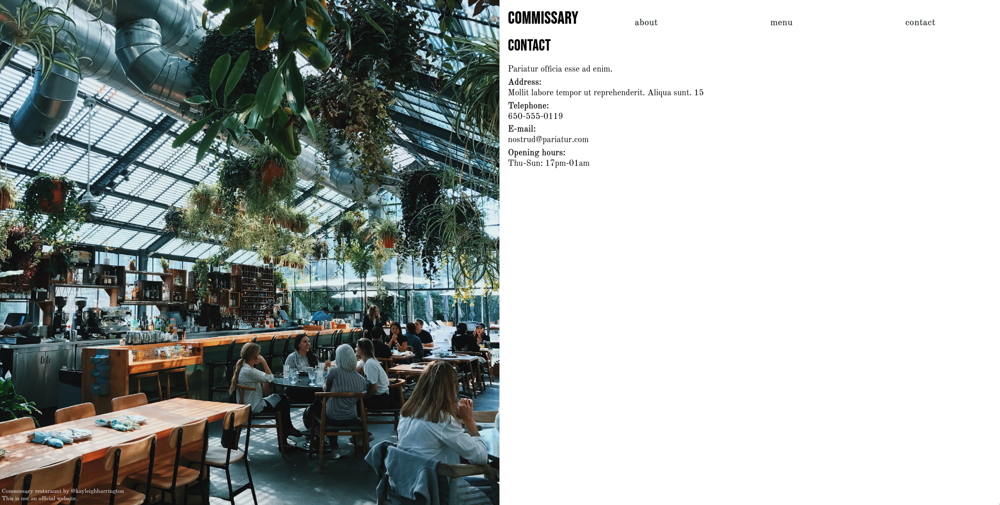

# Restaurant Page - A simple restaurant page with content managed by Javascript DOM manipulation

> This repo includes code for the Restaurant Page, developed as part of Microverse's Full Stack Development Program.

### Check it online!
[Live preview]()

## Built With
- Javascript
- Webpack

## Getting Started

To get a local copy up and running clone this repository to your
computer.
Install Node Modules with `npm install`
Build and watch the files with `npm run watch`

## Authors

👤Felipe dos Anjos

- Github: [@githubhandle](https://github.com/fc-anjos)
- Linkedin: [linkedin](https://linkedin.com/in/fc-anjos)

## Show your support

Give a ⭐️ if you like this project!

## 🤝 Contributing

Contributions, issues and feature requests are welcome!

Feel free to check the [issues
page](https://github.com/fc-anjos/library-app/issues).
